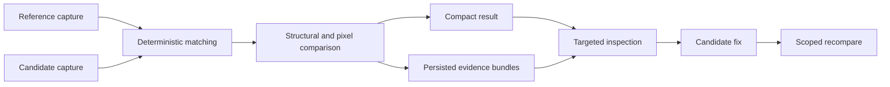

# Evidence and results

> Interpret Sameframe output without mistaking pixel changes, uncertain matches, or runtime failures for unsupported causal explanations.

Sameframe captures the full rendered page but returns a compact result. Inspection commands reveal persisted detail only when an agent needs it.

The important boundary is between the compact result, which supports triage, and persisted evidence, which supports investigation without recapture.

## Captures and nodes

Reference and candidate pages run in independent Chromium contexts. Each capture records navigation, stabilization, diagnostics, screenshot pixels, and a normalized UI tree. Node IDs are stable within that capture, not permanent identifiers across runs.

A UI node retains high-signal semantics, text, stable attributes, geometry, visibility, selected styles, full inspection styles, and optional source metadata. It excludes credentials, browser storage, password values, generated IDs, and irrelevant nodes.

## Matches and uncertainty

Matching favors explicit parity keys, test identifiers, accessible role and name, form identity, stable resources, normalized text, structure, classes, and geometry. A match records its contributing signals and confidence.

High-confidence pairs are compared automatically. Lower-confidence candidates remain explicit alternatives. Sameframe does not force a weak pair merely to reduce missing and extra findings.

## Findings and severity

Findings describe observed differences in these categories:

| Category           | Evidence                                                        |
| ------------------ | --------------------------------------------------------------- |
| `missing`, `extra` | An unmatched reference or candidate node.                       |
| `content`          | Different text or retained content values.                      |
| `semantic`         | Different roles, element kinds, or control states.              |
| `layout`           | Visibility, position, or dimensions beyond tolerance.           |
| `style`            | Different high-signal computed styles.                          |
| `visual`           | Changed screenshot pixels beyond the configured threshold.      |
| `runtime`          | Navigation, script, stylesheet, asset, page, or setup failures. |

Severity is deterministic and rule-based. A blank page or blocking runtime failure is critical; a missing primary control or major region is high; material secondary differences are medium; small or screenshot-only changes are low.

## Assertions and status

The compact result exposes `pageRendered`, `mainContentPresent`, `criticalContentMatches`, `layoutWithinTolerance`, and `runtimeHealthy`. Status follows those assertions and finding severities:

| Status   | Meaning                                                                | Next action                                   |
| -------- | ---------------------------------------------------------------------- | --------------------------------------------- |
| `pass`   | Required assertions passed with no critical or high findings.          | Accept the comparison or continue the matrix. |
| `review` | Medium findings, uncertainty, or unexplained screenshot drift remains. | Inspect the linked evidence.                  |
| `fail`   | A critical, high, or required parity assertion failed.                 | Fix the candidate and rerun.                  |
| `error`  | Capture or comparison did not complete reliably.                       | Inspect diagnostics before evaluating parity. |

The status is not a weighted similarity score. Pixel percentage and match confidence support a decision but do not replace explicit assertions.
